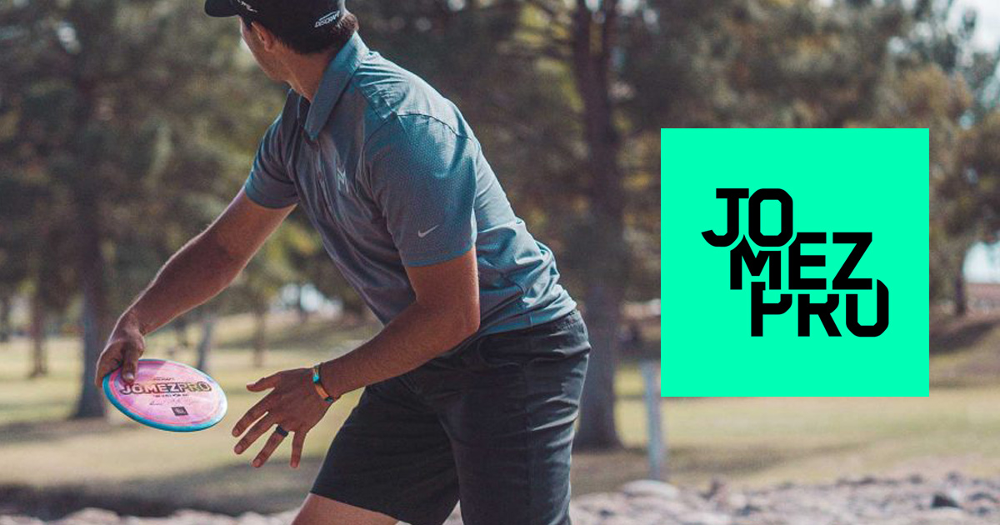

# Pro Disc Golf, Follow Flight, and Computer Vision


### Motivation

I was first introduced to pro disc golf via JomezPro, a production company that posts disc golf tournament coverage on YouTube. Since there is usually not free access to live pro tournament coverage, companies like JomezPro film pro disc golf rounds, edit the footage with graphics and commentary same day, then post the coverage on Youtube the following morning for fans to watch the previous days action. In 2020, watching JomezPro quickly became part of my weekend morning ritual somewhere between my first cup of coffee, homework, and getting out to play my local course in Raleigh.

<p align="center">
  
</p>

I would say three things make JomezPro special: 
1. Filming rights to lead cards (the top 4 players by score in a given tournament) 
2. Great commentary by pros, usually Paul Ulibarri, Jeremy Koling, and Nate Sexton
3. Top-notch production, highlighted by **Follow Flight** segments


### Follow Flight
Follow Flight is used when a player throws a great shot, generally a drive or long approach, and parks the disc under the basket. It is basically the slow motion dunk NBA replay equivalent to disc golf. An editor at JomezPro is tasked with editing the shot footage to follow the disc flight with a florescent ribbon effect so viewers can visualize the full flight of the disc and look with awe at the shot difficulty. I'm honestly not sure how long something like this takes from a video editing POV, but [these comments](https://www.reddit.com/r/discgolf/comments/85b8ta/jomez_pro_follow_flight/)  make it seem like a decent amount of work.


So, my question and purpose for this post is, can Follow Flight be automated? Hypothesis: Yes. Conclusion: Maybe, but probably not, at least by me right now.

### Computer vision and discs

Computer vision (CV) models have gotten pretty good at object detection and recognition in both image and video content.To automate a Follow Flight effect, you need to track a disc and animate a line through the entire
flight.

CV models are a bit outside my expertise but hey, I have access to Google and too much free time. CV models are generally built with Neural Networks and can be computationally expensive to train from scratch. My couch-based research led me to [ImageAI](https://github.com/OlafenwaMoses/ImageAI), a project consisting of open source tools to support image prediction, custom image prediction, object detection, video detection, video object tracking and image predictions trainings. From what I've read, ImageAI is a great place to start tinkering with CV as they provide a simple Python API and interface easily with pre-trained image recognition models like yolovX and RetinaNet.

Back to the problem at hand - can we use CV to track  a disc through a video? I happen to have a video of myself throwing at Maple Hill DG course that will work for this (ignore the part where I throw into the water).Using ImageAI, we can run a custom frisbee detection model from RetinaNet on the input video and recieve a tagged output. This took about 15 minutes to run on my Macbook and was only ~20 lines of Python code, pretty cool how easy it is to get up and running!


### Results
The model can only briefly identify the disc in my hand at the begining of the video, then completely loses the disc once it leaves my hand.This is certainly not as good as I hoped. There are a few problems right off the bat here.
1. Image quality is not great as this was shot on an Iphone, not a legit camera
2. I tuned literally no hyper-parameters, this is as out of the box as you get
3. Training data as noted in code line 13 was based on "frisbees". I'm wondering if this pre-trained model was trained only on the Wham-O/Ultimate/play catch with your dog variety of frisbee, and if there were any disc golf discs such as mine (lost forever now) included in the training data.

Next steps here seem pretty clear - if out of the box model is bad, maybe a custom trained model would do better? I have not gotten that far, but downloading a bunch of professionally shot disc golf video content and self tagging the training data for a few hours sounds awesome and terrible at the same time. It would be cool to do something like this at a larger scale with a service like [GCP Video API](https://cloud.google.com/video-intelligence/automl/docs/beginners-guide).

### Parting thoughts
This was a cool intro to computer vision and I hope to dive a bit deeper into custom model development and applications to daily life. Based on what I've read I think the biggest value in CV is for instant classification applications like self-driving car systems, but automation of disc golf video editing is a close second.

Code is below and was adapted from the ImageAI docs.

```python
from imageai.Detection import VideoObjectDetection #image ai package
import os
import time

# Initialize detector
execution_path = os.getcwd()
detector = VideoObjectDetection() 

# Load RetinaNet model
detector.setModelTypeAsRetinaNet()
detector.setModelPath( os.path.join(execution_path , "resnet50_coco_best_v2.1.0.h5"))
detector.loadModel()
custom_objects = detector.CustomObjects(frisbee=True) # detect only frisbees

# Run RetinaNet model
ret_time_start = process_time() # timer 
video_path = detector.detectCustomObjectsFromVideo(
                custom_objects=custom_objects,
                input_file_path=os.path.join(execution_path, "inputs/maple_hill_input.mp4"),
                output_file_path=os.path.join(execution_path, "outputs/mapple_hill_ret"),
                frames_per_second=20, log_progress=True)
ret_time_end = process_time()
ret_run_time = ret_time_end - ret_time_start
print(ret_run_time)

```


